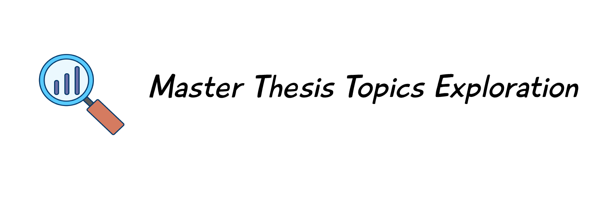

<div id="top"></div>
<!--
*** Thanks for checking out the Best-README-Template. If you have a suggestion
*** that would make this better, please fork the repo and create a pull request
*** or simply open an issue with the tag "enhancement".
*** Don't forget to give the project a star!
*** Thanks again! Now go create something AMAZING! :D
-->


<!-- PROJECT SHIELDS -->
<!--
*** I'm using markdown "reference style" links for readability.
*** Reference links are enclosed in brackets [ ] instead of parentheses ( ).
*** See the bottom of this document for the declaration of the reference variables
*** for contributors-url, forks-url, etc. This is an optional, concise syntax you may use.
*** https://www.markdownguide.org/basic-syntax/#reference-style-links
-->
[![Contributors][contributors-shield]][contributors-url]
[![Forks][forks-shield]][forks-url]
[![Stargazers][stars-shield]][stars-url]
[![Issues][issues-shield]][issues-url]
[![MIT License][license-shield]][license-url]
[![LinkedIn][linkedin-shield]][linkedin-url]


<!-- PROJECT LOGO -->
<br />
<div align="center">
  <a href="https://github.com/khaledbouabdallah/Master_Subjects_Analysis">
    
  </a>

<h3 align="center">A Dashboard for Master Thesis proposed topics</h3>

  <p align="center">
     Streamlit web application that allows the exploration of thesis topics data
    <br />
    <br />
    <a href="https://github.com/khaledbouabdallah/Master_Subjects_Analysis">View Web App</a>
    ·
    <a href="https://github.com/khaledbouabdallah/Master_Subjects_Analysis/issues">Report Bug</a>
    ·
    <a href="https://github.com/khaledbouabdallah/Master_Subjects_Analysis/issues">Request Feature</a>
  </p>
</div>


<!-- TABLE OF CONTENTS -->
<details>
  <summary>Table of Contents</summary>
  <ol>
    <li>
      <a href="#about-the-project">About The Project</a>
      <ul>
        <li><a href="#built-with">Built With</a></li>
      </ul>
    </li>
    <li>
      <a href="#getting-started">Getting Started</a>
      <ul>
        <li><a href="#prerequisites">Prerequisites</a></li>
        <li><a href="#installation">Installation</a></li>
      </ul>
    </li>
    <li><a href="#dataset">Dataset</a></li>
    <li><a href="#roadmap">Roadmap</a></li>
    <li><a href="#contributing">Contributing</a></li>
    <li><a href="#license">License</a></li>
    <li><a href="#contact">Contact</a></li>
    <li><a href="#acknowledgments">Acknowledgments</a></li>
  </ol>
</details>


<!-- ABOUT THE PROJECT -->
## About The Project
<div id="about-the-project"></div>

> An Exploratory Data Analysis of proposed Master thesis subjects

After the release of the proposed thesis subjects, I was curious, and I had so many questions ... for example:
- Most proposed subject (trending subject)
- Most prioritized specialty in our department
- Percentage of affected/unaffected topics.
- What makes a topic undesirable (Why some topics didn't get chosen)
So to kill my curiosity, I created an Interactive Dashboard to explore the data.
Also, it felt like a nice opportunity to see how much information can be extracted from relatively simple data.


### Built With
<div id="built-with"></div>

* [Streamlit](https://docs.streamlit.io/)
* [Pandas](https://pandas.pydata.org/pandas-docs/stable/index.html#)
* [altair](https://altair-viz.github.io/)

<p align="right">(<a href="#top">back to top</a>)</p>


<!-- GETTING STARTED -->
## Getting Started
<div id="getting-started"></div>

You can use the online version of the Dashboard located  [Here]()

or you can get a local version by following these steps:

### Prerequisites
<div id="prerequisites"></div>

First you need to have:
- python
- pip3
- venv

### Installation
<div id="installation"></div>

1. Clone the repo
   ```sh
   git clone https://github.com/khaledbouabdallah/Master_Subjects_Analysis.git
   ```
2. Create a new Virtual Environment
   ```sh
    python3 -m venv <name_of_virtualenv>
   ```
3. Activate the new Virtual Environment
    - windows
   ```
    <name_of_virtualenv>\Scripts\activate
   ``` 
   - Mac OS / Linux
   ```
    source <name_of_virtualenv>/bin/activate
   ```
4. Install dependencies
   ```
   pip install -r requirements.txt
   ```
5. Start streamlit server
   ```
   streamlit run app.py
   ```
   

<p align="right">(<a href="#top">back to top</a>)</p>


## Dataset Used
<div id="dataset"></div>


Each row in the dataset represents a proposed article from some teachers of 
Computer Science department (Faculty of Science/Ferhat Abbas Setif University) for 2022.

The data was collected by scraping some webpages found in the faculty website and saved as 
a csv file.

There is two version of the dataset:
1. original: this dataset contains only columns and data that was originally scraped for faculty website
2. modified: this dataset contains an additional column _Subject_ which was created manually,
this column contains one word that summarize the proposed topic.

__Note__: the data contained in  _Subject_ column was created from my initial guesses after reading the
title of a proposed thesis, if you think there is a mistake, please open an issue
[open issues](https://github.com/khaledbouabdallah/Master_Subjects_Analysis/issues)


___Dataset Columns___:
1. _ID_: topic ID
2. _Title_: topic title
3. _Teacher_: Teacher who proposed the topic
4. _Grade_: Teacher Grade (Academic Rank)
5. _Taken_: True if topic is selected by a student, otherwise False
6. _Priority 1_: Specialty who holds priority number 1
7. _Priority 2_: Specialty who holds priority number 2
8. _Priority 3_: Specialty who holds priority number 3
9. _Priority 4_: Specialty who holds priority number 4
10. _Priority 5_: Specialty who holds priority number 5
11. _Date_: topic publishing date.
12. _Time_: topic publishing time.
13. _Subject_: topic main keyword

Both datasets are available including the code used to scrap 
them and a clean version of the html files collected from the faculty website.

<p align="right">(<a href="#top">back to top</a>)</p>

<!-- ROADMAP -->
## Roadmap
<div id="roadmap"></div>

- [X] Data scraping (collection)
- [ ] subjects (keywords) completion
- [ ] streamlit app
  - [X] Home page
  - [X] General Statistics
  - [ ] Teacher Statistics
  - [ ] Grade Statistics
  - [ ] Speciality Statistics
  - [ ] Advanced page
  
See the [open issues](https://github.com/khaledbouabdallah/Master_Subjects_Analysis/issues) for a full list of proposed features (and known issues).

<p align="right">(<a href="#top">back to top</a>)</p>


<!-- CONTRIBUTING -->
## Contributing
<div id="contributing"></div>

If you have a suggestion that would make this better, please fork the repo and create a pull request. You can also simply open an issue with the tag "enhancement".
Don't forget to give the project a star! Thanks again!

1. Fork the Project
2. Create your Feature Branch (`git checkout -b feature/AmazingFeature`)
3. Commit your Changes (`git commit -m 'Add some AmazingFeature'`)
4. Push to the Branch (`git push origin feature/AmazingFeature`)
5. Open a Pull Request

<p align="right">(<a href="#top">back to top</a>)</p>


<!-- LICENSE -->
## License
<div id="license"></div>


Distributed under the MIT License. See `LICENSE.txt` for more information.

<p align="right">(<a href="#top">back to top</a>)</p>


<!-- CONTACT -->
## Contact
<div id="contact"></div>


Project Link: [https://github.com/khaledbouabdallah/Master_Subjects_Analysis](https://github.com/khaledbouabdallah/Master_Subjects_Analysis)

<p align="right">(<a href="#top">back to top</a>)</p>


<!-- ACKNOWLEDGMENTS -->
## Acknowledgments
<div id="acknowledgments"></div>


* [BoardGames Streamlit](https://github.com/MaartenGr/BoardGames)
* [README file template](https://github.com/othneildrew/Best-README-Template/)
* [Analysis Vectors by Vecteezy](https://www.vecteezy.com/free-vector/analysis)
* [Github banner generator](https://github.com/liyasthomas/banner)


<p align="right">(<a href="#top">back to top</a>)</p>


<!-- MARKDOWN LINKS & IMAGES -->
<!-- https://www.markdownguide.org/basic-syntax/#reference-style-links -->
[contributors-shield]: https://img.shields.io/github/contributors/khaledbouabdallah/Master_Subjects_Analysis.svg?style=for-the-badge
[contributors-url]: https://github.com/khaledbouabdallah/Master_Subjects_Analysis/graphs/contributors
[forks-shield]: https://img.shields.io/github/forks/khaledbouabdallah/Master_Subjects_Analysis.svg?style=for-the-badge
[forks-url]: https://github.com/khaledbouabdallah/Master_Subjects_Analysis/network/members
[stars-shield]: https://img.shields.io/github/stars/khaledbouabdallah/Master_Subjects_Analysis.svg?style=for-the-badge
[stars-url]: https://github.com/khaledbouabdallah/Master_Subjects_Analysis/stargazers
[issues-shield]: https://img.shields.io/github/issues/khaledbouabdallah/Master_Subjects_Analysis.svg?style=for-the-badge
[issues-url]: https://github.com/khaledbouabdallah/Master_Subjects_Analysis/issues
[license-shield]: https://img.shields.io/github/license/khaledbouabdallah/Master_Subjects_Analysis.svg?style=for-the-badge
[license-url]: https://github.com/khaledbouabdallah/Master_Subjects_Analysis/blob/master/LICENSE.txt
[linkedin-shield]: https://img.shields.io/badge/-LinkedIn-black.svg?style=for-the-badge&logo=linkedin&colorB=555
[linkedin-url]: https://www.linkedin.com/in/khaled-bouabdallah-99b283191/
[product-screenshot]: images/screenshot.png